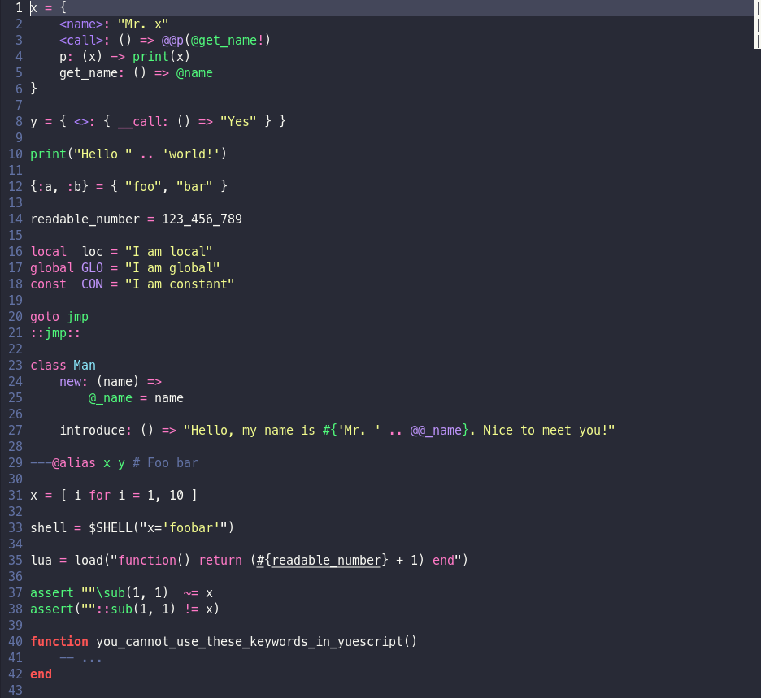

# [Yuescript][yue] support for the [micro text editor][micro]

## Install

Just copy `yuescript.yaml` in `~/.config/micro/syntax/`. Alternatively, you can use a symlink. I'd recommend doing that, because then you can update by just updating this repo with `git pull` instead of manually replacing the file.

## Demo

The above screenshot was taken with the `dracula-tc` theme, with truecolor mode enabled.

## License

This repo is licensed under the terms of the MIT "Expat" license. See [`LICENSE`](LICENSE) for refernece.

[yue]: https://github.com/pigpigyyy/Yuescript
[micro]: https://github.com/zyedidia/micro
